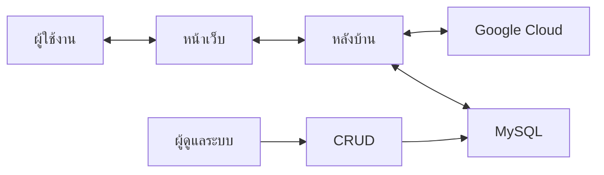

### เว็บ ตรวจสลากกาชาดการกุศลจังหวัดน่าน
- ตรวจสลากกาชาดการกุศลจังหวัดน่าน
- งานประจำปีของดีเมืองน่าน 
### การพัฒนา
- ได้มีการพัฒนาโดยใช้ภาษา PHP และ Javascript 
- ใช้เทคโนโลยีของ Container (Docker) ในการสร้างฐานข้อมูล และ เว็บไซต์เพื่อให้ง่ายต่อการใช้งาน และ การพัฒนา 
- ได้พัฒนาต่อ ส่วนของ OCR (Optical Character Recognition) ที่ได้พัฒนามาก่อนหน้านี้ เเล้ว
## ตัวอย่างในการใช้งานเว็บ
- การค้นหาด้วยตัวเลข


- การค้นหาโดย OCR

# โครงสร้างของเว็บไซต์

# การพัฒนา Deployment 
- clone โปรเจคจาก github 
```bash
git clone https://github.com/JeerasakAnanta/redcross_lottery_nan.git
cd redcross_lottery_nan 
```
- เปลี่ยนค่าตัวแปรในไฟล์ .env.example ให้เป็นไฟล์ .env
```bash
cp .env.example .env
```
- แก้ไขไฟล์ .env ให้ตรงกับของเราเอง
```bash
# API keys
API_KEY=your_api_key

# Other configuration
DEBUG=true
SECRET_KEY=your_secret_key

# Node configuration
NODE_PORT=3030

# MySQL configuration
MYSQL_PORT=3306
MYSQL_DATABASE=yoursql_db
MYSQL_USERNAME=yoursql_user
MYSQL_PASSWORD=yoursql_password
MYSQL_ROOT_PASSWORD=yoursql_root_password

# Google Cloud configuration 🤑
GOOGLE_PROJECT_ID=...
GOOGLE_PRIVATE_KEY_ID=...
GOOGLE_PRIVATE_KEY=...
GOOGLE_CLIENT_EMAIL=...
GOOGLE_CLIENT_ID=...
GOOGLE_CLIENT_X509_CERT_URL=...
```

## การติดตั้งโปรเจคโดยใช้ Docker ผ่าน bash script 🧙‍♂️
- ติดตั้งโปรเจคโดยใช้ bash script (Magic install script) 
```bash
chmod +x build_docker.sh
```
- รันไฟล์
```bash
./build_docker.sh
```
## ทดสอบการใช้งานโดยเข้าไปที่
- web (user) http://localhost
- web (admin) http://localhost/admin
- phpmyadmin http://localhost:8080
- ตัวอย่างการใช้งาน การทำงาน docker ใน docker desktop

## สร้างฐานข้อมูล MySQL
- สร้างฐานข้อมูลชื่อ lotteries ใน http://localhost:8080
```sql
    CREATE DATABASE lotteries;
```
- สร้างตารางชื่อ lottery  ในฐานข้อมูล lotteries
```sql
    CREATE TABLE lottery (
    id INT AUTO_INCREMENT PRIMARY KEY,  -- รหัสประจำตัวของแต่ละรายการ (เพิ่มอัตโนมัติ)
    lottery_number VARCHAR(20) NOT NULL,    -- หมายเลขสลาก (ประเภท String)
    reward_number VARCHAR(20) NOT NULL,     -- หมายเลขรางวัล (ประเภท String)
    created_at TIMESTAMP DEFAULT CURRENT_TIMESTAMP  -- เวลาที่สร้างรายการ
);
```
## พัฒนาโปรเจคโดย 
- [Jeerasak Ananta SS4](https://github.com/JeerasakAnanta) 🍻
- [Prachya](https://github.com/pabigmz)🚀