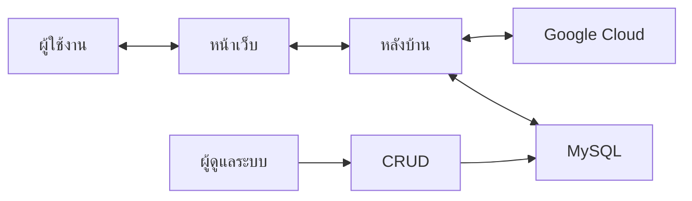
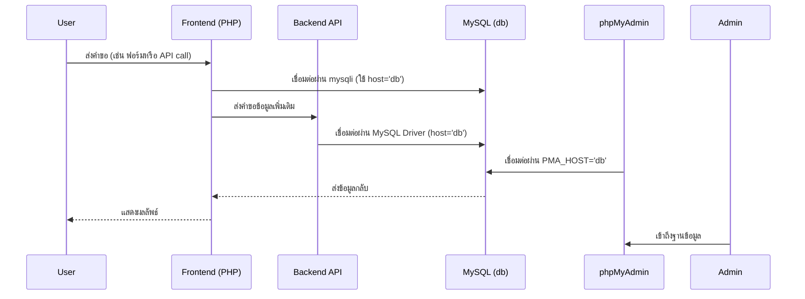
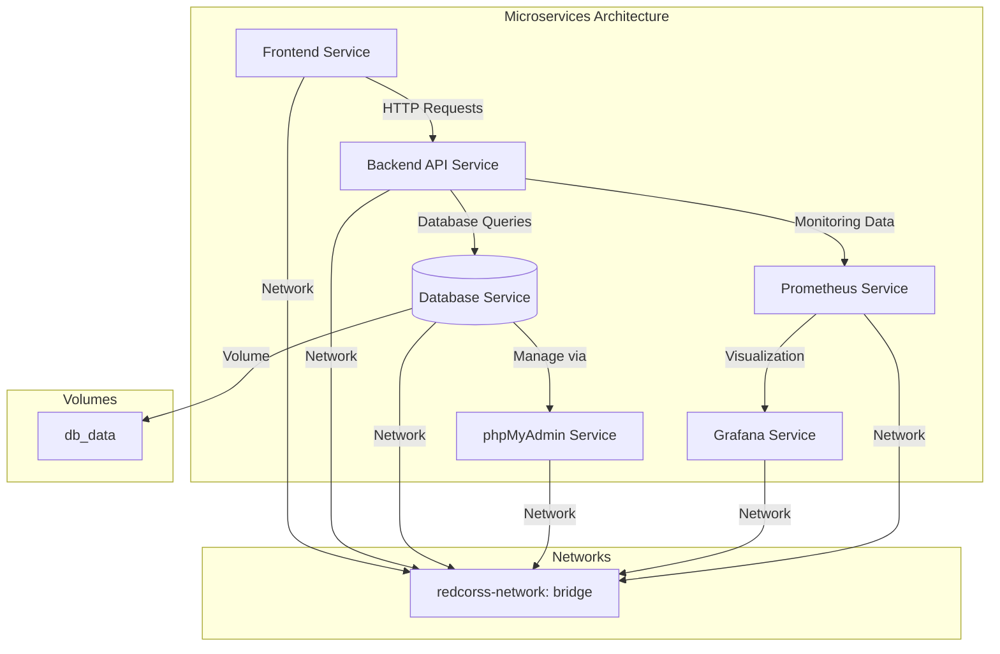

### เว็บตรวจสลากกาชาดการกุศลจังหวัดน่าน
- ตรวจสลากกาชาดการกุศลจังหวัดน่าน
- งานประจำปีของดีเมืองน่าน 
  
### การพัฒนาโปรเจค 
- ได้มีการพัฒนาโดยใช้ภาษา PHP และ Javascript 
- ใช้เทคโนโลยีของ Container (Docker) ในการสร้างฐานข้อมูล และ เว็บไซต์เพื่อให้ง่ายต่อการใช้งาน และ การพัฒนา 
- ได้พัฒนาต่อ ส่วนของ OCR (Optical Character Recognition) ที่ได้พัฒนามาก่อนหน้านี้ เเล้ว
- พัฒนาโดยนักศึกษา สาขาวิทยาการคอมพิวเตอร์ มหาวิทยาลัย ราชมงคลล้านนา น่าน 
## ตัวอย่างในการใช้งานเว็บ
- การค้นหาด้วยตัวเลข ผ่านหน้าเว็บ 


- การค้นหาโดย OCR

# โครงสร้างของเว็บไซต์

# การสร้าง environment สำหรับ Depoly
- ติดตั้งโปรแกรม Docker และ Docker Compose ในเครื่อง 
```bash 
sudo apt-get update 
sudo apt-get install docker.io -y 
sudo apt-get install docker-compose -y 
```
- ตรวจสอบการติดตั้ง Docker และ Docker Compose
```bash
docker --version
docker-compose --version
```
- ติดตั้งโปรแกรม webserver ngingx ในเครื่อง
```bash
sudo apt-get install nginx
```
- เป็นการใช้งาน nginx ในการทดสอบการใช้งานเว็บไซต์
```bash
sudo systemctl start nginx
sudo systemctl enable nginx
```
- ทดสอบ ngnix  
```bash  
sudo systemcmt status nginx 
```
- ติดตั้ง Certbot
```bash
sudo apt install certbot python3-certbot-nginx
```
- ขอใบรับรอง SSL ใช้งาน Certbot เพื่อขอใบรับรอง SSL สำหรับโดเมน `You-Domain`:
```bash 
sudo certbot --nginx -d You-Domain
```
- ตั้งค่า NGINX สำหรับ Node.js 
```bash
sudo vim /etc/nginx/sites-available/you-domain
```
- config ไฟล์ nginx ให้เป็นไฟล์ default ใน /etc/nginx/sites-available/you-domain
```bash
server {
    listen 80;
    server_name You-Domain;

    # Redirect all traffic to HTTPS
    return 301 https://$host$request_uri;
}

server {
    listen 443 ssl;
    server_name You-Domain;

    ssl_certificate /etc/letsencrypt/live/You-Domain/fullchain.pem;
    ssl_certificate_key /etc/letsencrypt/live/You-Domain/privkey.pem;

    location /api_recross_ocr/ {
        proxy_pass http://localhost:3000/api_recross_ocr/;
        proxy_set_header Host $host;
        proxy_set_header X-Real-IP $remote_addr;
        proxy_set_header X-Forwarded-For $proxy_add_x_forwarded_for;
        proxy_set_header X-Forwarded-Proto $scheme;
    }
}
```
- เปิดใช้งานการตั้งค่าของ NGINX
```bash 
sudo ln -s /etc/nginx/sites-available/You-Domain /etc/nginx/sites-enabled/
```
-  ทดสอบการตั้งค่า NGINX
```bash 
sudo nginx -t
```
- รีสตาร์ท NGINX
```bash 
sudo systemctl restart nginx
```
# การพัฒนา Deployment 
- clone โปรเจคจาก github 
```bash
git clone https://github.com/JeerasakAnanta/redcross_lottery_nan.git
cd redcross_lottery_nan 
```
- เปลี่ยนค่าตัวแปรในไฟล์ .env.example ให้เป็นไฟล์ .env
```bash
cp .env.example .env
```
- แก้ไขไฟล์ .env ให้ตรงกับของเราเอง
```bash
# API keys

# Other configuration
SECRET_KEY=your_secret_key

# Node configuration
NODE_PORT=3000

# MySQL configuration
MYSQL_PORT=3306
MYSQL_DATABASE=yoursql_db
MYSQL_USERNAME=yoursql_user
MYSQL_PASSWORD=yoursql_password
MYSQL_ROOT_PASSWORD=yoursql_root_password

# Google Cloud configuration 🤑
GOOGLE_PROJECT_ID=...
GOOGLE_PRIVATE_KEY_ID=...
GOOGLE_PRIVATE_KEY=...
GOOGLE_CLIENT_EMAIL=...
GOOGLE_CLIENT_ID=...
GOOGLE_CLIENT_X509_CERT_URL=...
```

## การติดตั้งโปรเจคโดยใช้ Docker ผ่าน bash script 🧙‍♂️
- ติดตั้งโปรเจคโดยใช้ bash script (Magic install script) 
```bash
chmod +x build_docker.sh
```
- รันไฟล์
```bash
./build_docker.sh
```
## ทดสอบการใช้งานโดยเข้าไปที่
- web (user) http://your-ip-address
- web (admin) http://your-ip-address/admin
- phpmyadmin http://your-ip-address:8080
- ตัวอย่างการใช้งาน การทำงาน docker ใน docker desktop

## สร้างฐานข้อมูล MySQL
- สร้างฐานข้อมูลชื่อ db ใน http://your-ip-address:8080
```sql
    CREATE DATABASE lotteries;
```
- สร้างตารางชื่อ lottery  ในฐานข้อมูลชื่อ  db
```sql
    CREATE TABLE lottery (
    id INT AUTO_INCREMENT PRIMARY KEY,              -- รหัสประจำตัวของแต่ละรายการ (เพิ่มอัตโนมัติ)
    lottery_number VARCHAR(20) NOT NULL,            -- หมายเลขสลาก (ประเภท String)
    reward_number VARCHAR(20) NOT NULL,             -- หมายเลขรางวัล (ประเภท String)
    created_at TIMESTAMP DEFAULT CURRENT_TIMESTAMP  -- เวลาที่สร้างรายการ
);
```
## การเชื่อมต่อระหว่าง Frontend และ Backend API กับ MySQL

## โครงสร้างการทำงาน  Microservices Architecture


## พัฒนาโปรเจคโดย 
- [Jeerasak Ananta SS4](https://github.com/JeerasakAnanta) 🍻
- [Prachya](https://github.com/pabigmz)🚀

## Mockup Database 
```sql
INSERT INTO lotterys (lottery_number, reward_number, createdAt, updatedAt) VALUES
('132137', 1, NOW(), NOW()),
('035158', 2, NOW(), NOW()), 
('129715', 3, NOW(), NOW()),
('018415', 3, NOW(), NOW()), 
('179006', 3, NOW(), NOW()),
('089491', 3, NOW(), NOW()), 
('155484', 3, NOW(), NOW()),
('065089', 4, NOW(), NOW()), 
('092932', 4, NOW(), NOW()), 
('090780', 4, NOW(), NOW()), 
('044492', 4, NOW(), NOW()), 
('059714', 4, NOW(), NOW()), 
('085243', 4, NOW(), NOW()), 
('115367', 4, NOW(), NOW()),
('101048', 4, NOW(), NOW()),
('020822', 4, NOW(), NOW()), 
('072170', 4, NOW(), NOW()), 
('068937', 5, NOW(), NOW()), 
('104411', 5, NOW(), NOW()),
('010620', 5, NOW(), NOW()), 
('159264', 5, NOW(), NOW()),
('046552', 5, NOW(), NOW()), 
('006447', 5, NOW(), NOW()), 
('052871', 5, NOW(), NOW()), 
('104119', 5, NOW(), NOW()),
('105607', 5, NOW(), NOW()),
('032510', 5, NOW(), NOW()), 
('067427', 6, NOW(), NOW()), 
('075772', 6, NOW(), NOW()), 
('086856', 6, NOW(), NOW()), 
('163530', 6, NOW(), NOW()),
('067874', 6, NOW(), NOW()), 
('161096', 6, NOW(), NOW()),
('118997', 6, NOW(), NOW()),
('170573', 6, NOW(), NOW()),
('060817', 6, NOW(), NOW()), 
('040482', 6, NOW(), NOW()), 
('086004', 6, NOW(), NOW()), 
('198791', 6, NOW(), NOW()),
('071681', 6, NOW(), NOW()), 
('114796', 6, NOW(), NOW()),
('161044', 6, NOW(), NOW()),
('000186', 7, NOW(), NOW()); 
```