### เว็บตรวจสลากกาชาดการกุศลจังหวัดน่าน
- ตรวจสลากกาชาดการกุศลจังหวัดน่าน
- งานประจำปีของดีเมืองน่าน 
  
### การพัฒนาโปรเจค 
- ได้มีการพัฒนาโดยใช้ภาษา PHP และ Javascript 
- ใช้เทคโนโลยีของ Container (Docker) ในการสร้างฐานข้อมูล และ เว็บไซต์เพื่อให้ง่ายต่อการใช้งาน และ การพัฒนา 
- ได้พัฒนาต่อ ส่วนของ OCR (Optical Character Recognition) ที่ได้พัฒนามาก่อนหน้านี้ เเล้ว
- พัฒนาโดยนักศึกษา สาขาวิทยาการคอมพิวเตอร์ มหาวิทยาลัย ราชมงคลธล้านนา น่าน 
## ตัวอย่างในการใช้งานเว็บ
- การค้นหาด้วยตัวเลข


- การค้นหาโดย OCR

# โครงสร้างของเว็บไซต์

```mermaid
graph LR
    A[หน้าเว็บ] <--> B[หลังบ้าน]
    B <--> GOOGLE[Google Cloud]
    B <--> MYSQL[MySQL]
    C[ผู้ใช้งาน] <--> A
    admin[ผู้ดูแลระบบ] --> crud[CRUD]
    crud --> MYSQL
    
```

# การพัฒนา Deployment 
- clone โปรเจคจาก github 
```bash
git clone https://github.com/JeerasakAnanta/redcross_lottery_nan.git
cd redcross_lottery_nan 
```
- เปลี่ยนค่าตัวแปรในไฟล์ .env.example ให้เป็นไฟล์ .env
```bash
cp .env.example .env
```
- แก้ไขไฟล์ .env ให้ตรงกับของเราเอง
```bash
# API keys
API_KEY=your_api_key

# Other configuration
DEBUG=true
SECRET_KEY=your_secret_key

# Node configuration
NODE_PORT=3030

# MySQL configuration
MYSQL_PORT=3306
MYSQL_DATABASE=yoursql_db
MYSQL_USERNAME=yoursql_user
MYSQL_PASSWORD=yoursql_password
MYSQL_ROOT_PASSWORD=yoursql_root_password

# Google Cloud configuration 🤑
GOOGLE_PROJECT_ID=...
GOOGLE_PRIVATE_KEY_ID=...
GOOGLE_PRIVATE_KEY=...
GOOGLE_CLIENT_EMAIL=...
GOOGLE_CLIENT_ID=...
GOOGLE_CLIENT_X509_CERT_URL=...
```

## การติดตั้งโปรเจคโดยใช้ Docker ผ่าน bash script 🧙‍♂️
- ติดตั้งโปรเจคโดยใช้ bash script (Magic install script) 
```bash
chmod +x build_docker.sh
```
- รันไฟล์
```bash
./build_docker.sh
```
## ทดสอบการใช้งานโดยเข้าไปที่
- web (user) http://your-ip-address
- web (admin) http://your-ip-address/admin
- phpmyadmin http://your-ip-address:8080
- ตัวอย่างการใช้งาน การทำงาน docker ใน docker desktop

## สร้างฐานข้อมูล MySQL
- สร้างฐานข้อมูลชื่อ db ใน http://your-ip-address:8080
```sql
    CREATE DATABASE lotteries;
```
- สร้างตารางชื่อ lottery  ในฐานข้อมูลชื่อ  db
```sql
    CREATE TABLE lottery (
    id INT AUTO_INCREMENT PRIMARY KEY,              -- รหัสประจำตัวของแต่ละรายการ (เพิ่มอัตโนมัติ)
    lottery_number VARCHAR(20) NOT NULL,            -- หมายเลขสลาก (ประเภท String)
    reward_number VARCHAR(20) NOT NULL,             -- หมายเลขรางวัล (ประเภท String)
    created_at TIMESTAMP DEFAULT CURRENT_TIMESTAMP  -- เวลาที่สร้างรายการ
);
```
## การเชื่อมต่อระหว่าง Frontend และ Backend API กับ MySQL

```mermaid
sequenceDiagram
    participant User
    participant Frontend (PHP)
    participant Backend API
    participant MySQL (db)
    participant phpMyAdmin
    participant Admin 

    User->>Frontend (PHP): ส่งคำขอ (เช่น ฟอร์มหรือ API call)
    Frontend (PHP)->>MySQL (db): เชื่อมต่อผ่าน mysqli (ใช้ host='db')
    Frontend (PHP)->>Backend API: ส่งคำขอข้อมูลเพิ่มเติม
    Backend API->>MySQL (db): เชื่อมต่อผ่าน MySQL Driver (host='db')
    phpMyAdmin->>MySQL (db): เชื่อมต่อผ่าน PMA_HOST='db'
    MySQL (db)-->>Frontend (PHP): ส่งข้อมูลกลับ
    Frontend (PHP)-->>User: แสดงผลลัพธ์

    Admin->>phpMyAdmin: เข้าถึงฐานข้อมูล

``` 

## โครงสร้างการทำงาน  Microservices Architecture


## พัฒนาโปรเจคโดย 
- [Jeerasak Ananta SS4](https://github.com/JeerasakAnanta) 🍻
- [Prachya](https://github.com/pabigmz)🚀