### เว็บตรวจสลากกาชาดการกุศลจังหวัดน่าน
- ตรวจสลากกาชาดการกุศลจังหวัดน่าน
- งานประจำปีของดีเมืองน่าน 
  
### การพัฒนาโปรเจค 
- ได้มีการพัฒนาโดยใช้ภาษา PHP และ Javascript 
- ใช้เทคโนโลยีของ Container (Docker) ในการสร้างฐานข้อมูล และ เว็บไซต์เพื่อให้ง่ายต่อการใช้งาน และ การพัฒนา 
- ได้พัฒนาต่อ ส่วนของ OCR (Optical Character Recognition) ที่ได้พัฒนามาก่อนหน้านี้ เเล้ว
- พัฒนาโดยนักศึกษา สาขาวิทยาการคอมพิวเตอร์ มหาวิทยาลัย ราชมงคลล้านนา น่าน 
## ตัวอย่างในการใช้งานเว็บ
- การค้นหาด้วยตัวเลข ผ่านหน้าเว็บ 


## TO-do
- [ ] การเพิ่มระบบมีรางวัน
- [ ] ระบบ loging 
- [ ] fix : การจัดการเพิ่มลบ lotterie 
- การค้นหาโดย OCR

# โครงสร้างของเว็บไซต์

```mermaid
graph LR
    A[หน้าเว็บ] <--> B[หลังบ้าน]
    B <--> GOOGLE[Google Cloud]
    B <--> MYSQL[MySQL]
    C[ผู้ใช้งาน] <--> A
    admin[ผู้ดูแลระบบ] --> crud[CRUD]
    crud --> MYSQL
    
```

# การสร้าง environment สำหรับ Depoly
- ติดตั้งโปรแกรม Docker และ Docker Compose ในเครื่อง 
```bash 
sudo apt-get update 
sudo apt-get install docker.io -y 
sudo apt-get install docker-compose -y 
```
- ตรวจสอบการติดตั้ง Docker และ Docker Compose
```bash
docker --version
docker-compose --version
```
- ติดตั้งโปรแกรม webserver ngingx ในเครื่อง
```bash
sudo apt-get install nginx
```
- เป็นการใช้งาน nginx ในการทดสอบการใช้งานเว็บไซต์
```bash
sudo systemctl start nginx
sudo systemctl enable nginx
```
- ทดสอบ ngnix  
```bash  
sudo systemcmt status nginx 
```
- ติดตั้ง Certbot
```bash
sudo apt install certbot python3-certbot-nginx
```
- ขอใบรับรอง SSL ใช้งาน Certbot เพื่อขอใบรับรอง SSL สำหรับโดเมน `You-Domain`:
```bash 
sudo certbot --nginx -d You-Domain
```
- ตั้งค่า NGINX สำหรับ Node.js 
```bash
sudo vim /etc/nginx/sites-available/you-domain
```
- config ไฟล์ nginx ให้เป็นไฟล์ default ใน /etc/nginx/sites-available/you-domain
```bash
server {
    listen 80;
    server_name You-Domain;

    # Redirect all traffic to HTTPS
    return 301 https://$host$request_uri;
}

server {
    listen 443 ssl;
    server_name You-Domain;

    ssl_certificate /etc/letsencrypt/live/You-Domain/fullchain.pem;
    ssl_certificate_key /etc/letsencrypt/live/You-Domain/privkey.pem;

    location /api_recross_ocr/ {
        proxy_pass http://localhost:3000/api_recross_ocr/;
        proxy_set_header Host $host;
        proxy_set_header X-Real-IP $remote_addr;
        proxy_set_header X-Forwarded-For $proxy_add_x_forwarded_for;
        proxy_set_header X-Forwarded-Proto $scheme;
    }
}
```
- เปิดใช้งานการตั้งค่าของ NGINX
```bash 
sudo ln -s /etc/nginx/sites-available/You-Domain /etc/nginx/sites-enabled/
```
-  ทดสอบการตั้งค่า NGINX
```bash 
sudo nginx -t
```
- รีสตาร์ท NGINX
```bash 
sudo systemctl restart nginx
```
# การพัฒนา Deployment 
- clone โปรเจคจาก github 
```bash
git clone https://github.com/JeerasakAnanta/redcross_lottery_nan.git
cd redcross_lottery_nan 
```
- เปลี่ยนค่าตัวแปรในไฟล์ .env.example ให้เป็นไฟล์ .env
```bash
cp .env.example .env
```
- แก้ไขไฟล์ .env ให้ตรงกับของเราเอง
```bash
# API keys

# Other configuration
SECRET_KEY=your_secret_key

# Node configuration
NODE_PORT=3000

# MySQL configuration
MYSQL_PORT=3306
MYSQL_DATABASE=yoursql_db
MYSQL_USERNAME=yoursql_user
MYSQL_PASSWORD=yoursql_password
MYSQL_ROOT_PASSWORD=yoursql_root_password

# Google Cloud configuration 🤑
GOOGLE_PROJECT_ID=...
GOOGLE_PRIVATE_KEY_ID=...
GOOGLE_PRIVATE_KEY=...
GOOGLE_CLIENT_EMAIL=...
GOOGLE_CLIENT_ID=...
GOOGLE_CLIENT_X509_CERT_URL=...
```

## การติดตั้งโปรเจคโดยใช้ Docker ผ่าน bash script 🧙‍♂️
- ติดตั้งโปรเจคโดยใช้ bash script (Magic install script) 
```bash
chmod +x build_docker.sh
```
- รันไฟล์
```bash
./build_docker.sh
```
## ทดสอบการใช้งานโดยเข้าไปที่
- web (user) http://your-ip-address
- web (admin) http://your-ip-address/admin
- phpmyadmin http://your-ip-address:8080
- ตัวอย่างการใช้งาน การทำงาน docker ใน docker desktop

## สร้างฐานข้อมูล MySQL
- สร้างฐานข้อมูลชื่อ db ใน http://your-ip-address:8080
```sql
    CREATE DATABASE lotteries;
```
- สร้างตารางชื่อ lottery  ในฐานข้อมูลชื่อ  db
```sql
    CREATE TABLE lottery (
    id INT AUTO_INCREMENT PRIMARY KEY,              -- รหัสประจำตัวของแต่ละรายการ (เพิ่มอัตโนมัติ)
    lottery_number VARCHAR(20) NOT NULL,            -- หมายเลขสลาก (ประเภท String)
    reward_number VARCHAR(20) NOT NULL,             -- หมายเลขรางวัล (ประเภท String)
    created_at TIMESTAMP DEFAULT CURRENT_TIMESTAMP  -- เวลาที่สร้างรายการ
);
```
## การเชื่อมต่อระหว่าง Frontend และ Backend API กับ MySQL

```mermaid
sequenceDiagram
    participant User
    participant Frontend (PHP)
    participant Backend API
    participant MySQL (db)
    participant phpMyAdmin
    participant Admin 

    User->>Frontend (PHP): ส่งคำขอ (เช่น ฟอร์มหรือ API call)
    Frontend (PHP)->>MySQL (db): เชื่อมต่อผ่าน mysqli (ใช้ host='db')
    Frontend (PHP)->>Backend API: ส่งคำขอข้อมูลเพิ่มเติม
    Backend API->>MySQL (db): เชื่อมต่อผ่าน MySQL Driver (host='db')
    phpMyAdmin->>MySQL (db): เชื่อมต่อผ่าน PMA_HOST='db'
    MySQL (db)-->>Frontend (PHP): ส่งข้อมูลกลับ
    Frontend (PHP)-->>User: แสดงผลลัพธ์

    Admin->>phpMyAdmin: เข้าถึงฐานข้อมูล

``` 

## โครงสร้างการทำงาน  Microservices Architecture


## พัฒนาโปรเจคโดย 
- [Jeerasak Ananta SS4](https://github.com/JeerasakAnanta) 🍻
- [Prachya](https://github.com/pabigmz)🚀

## Mockup Database 
- create table  

```sql
-- 1. Create the table structure
CREATE TABLE IF NOT EXISTS `lotteries` (
  `id` INT NOT NULL,
  `lottery_number` INT NOT NULL,
  `reward_number` INT NOT NULL,
  `createdAt` DATETIME NOT NULL,
  `updatedAt` DATETIME NOT NULL,
  PRIMARY KEY (`id`)
) ENGINE=InnoDB DEFAULT CHARSET=utf8mb4;
```

-insert data to table  lotteries
```sql

INSERT INTO `lotteries` (`id`, `lottery_number`, `reward_number`, `createdAt`, `updatedAt`) VALUES
(220, 865535, 2, '2025-01-26 04:33:35', '2025-01-26 04:33:35'),
(221, 905625, 3, '2025-01-26 04:33:35', '2025-01-26 04:33:35'),
(222, 931519, 4, '2025-01-26 04:33:35', '2025-01-26 04:33:35'),
(223, 940721, 5, '2025-01-26 04:33:35', '2025-01-26 04:33:35'),
(224, 909047, 6, '2025-01-26 04:33:35', '2025-01-26 04:33:35'),
(225, 723074, 7, '2025-01-26 04:33:35', '2025-01-26 04:33:35'),
(226, 788230, 8, '2025-01-26 04:33:35', '2025-01-26 04:33:35'),
(227, 771928, 9, '2025-01-26 04:33:35', '2025-01-26 04:33:35'),
(228, 494952, 10, '2025-01-26 04:33:35', '2025-01-26 04:33:35'),
(229, 958977, 11, '2025-01-26 04:33:35', '2025-01-26 04:33:35'),
(230, 510027, 12, '2025-01-26 04:33:35', '2025-01-26 04:33:35'),
(231, 473206, 13, '2025-01-26 04:33:35', '2025-01-26 04:33:35'),
(232, 735950, 14, '2025-01-26 04:33:35', '2025-01-26 04:33:35'),
(233, 360134, 15, '2025-01-26 04:33:35', '2025-01-26 04:33:35'),
(234, 392819, 16, '2025-01-26 04:33:35', '2025-01-26 04:33:35'),
(235, 783692, 17, '2025-01-26 04:33:35', '2025-01-26 04:33:35'),
(236, 840006, 18, '2025-01-26 04:33:35', '2025-01-26 04:33:35'),
(237, 848955, 19, '2025-01-26 04:33:35', '2025-01-26 04:33:35'),
(238, 724756, 20, '2025-01-26 04:33:35', '2025-01-26 04:33:35'),
(239, 976918, 21, '2025-01-26 04:33:35', '2025-01-26 04:33:35'),
(240, 810321, 22, '2025-01-26 04:33:35', '2025-01-26 04:33:35'),
(241, 120852, 23, '2025-01-26 04:33:35', '2025-01-26 04:33:35'),
(242, 773298, 24, '2025-01-26 04:33:35', '2025-01-26 04:33:35'),
(243, 703934, 25, '2025-01-26 04:33:35', '2025-01-26 04:33:35'),
(244, 199775, 26, '2025-01-26 04:33:35', '2025-01-26 04:33:35'),
(245, 587075, 27, '2025-01-26 04:33:35', '2025-01-26 04:33:35'),
(246, 436052, 28, '2025-01-26 04:33:35', '2025-01-26 04:33:35'),
(247, 319033, 29, '2025-01-26 04:33:35', '2025-01-26 04:33:35'),
(248, 187010, 30, '2025-01-26 04:33:35', '2025-01-26 04:33:35'),
(249, 777950, 31, '2025-01-26 04:33:35', '2025-01-26 04:33:35'),
(250, 528722, 32, '2025-01-26 04:33:35', '2025-01-26 04:33:35'),
(251, 209760, 33, '2025-01-26 04:33:35', '2025-01-26 04:33:35'),
(252, 262635, 34, '2025-01-26 04:33:35', '2025-01-26 04:33:35'),
(253, 583895, 35, '2025-01-26 04:33:35', '2025-01-26 04:33:35'),
(254, 231569, 36, '2025-01-26 04:33:35', '2025-01-26 04:33:35'),
(255, 206161, 37, '2025-01-26 04:33:35', '2025-01-26 04:33:35'),
(256, 236099, 38, '2025-01-26 04:33:35', '2025-01-26 04:33:35'),
(257, 462014, 39, '2025-01-26 04:33:35', '2025-01-26 04:33:35'),
(258, 601774, 40, '2025-01-26 04:33:35', '2025-01-26 04:33:35'),
(259, 622827, 41, '2025-01-26 04:33:35', '2025-01-26 04:33:35'),
(260, 308813, 42, '2025-01-26 04:33:35', '2025-01-26 04:33:35'),
(261, 475587, 43, '2025-01-26 04:33:35', '2025-01-26 04:33:35'),
(262, 451493, 44, '2025-01-26 04:33:35', '2025-01-26 04:33:35'),
(263, 730707, 45, '2025-01-26 04:33:35', '2025-01-26 04:33:35'),
(264, 399054, 46, '2025-01-26 04:33:35', '2025-01-26 04:33:35'),
(265, 603151, 47, '2025-01-26 04:33:35', '2025-01-26 04:33:35'),
(266, 818595, 48, '2025-01-26 04:33:35', '2025-01-26 04:33:35'),
(267, 383523, 49, '2025-01-26 04:33:35', '2025-01-26 04:33:35'),
(268, 261831, 50, '2025-01-26 04:33:35', '2025-01-26 04:33:35'),
(269, 958585, 51, '2025-01-26 04:33:35', '2025-01-26 04:33:35'),
(270, 307432, 52, '2025-01-26 04:33:35', '2025-01-26 04:33:35'),
(271, 361406, 53, '2025-01-26 04:33:35', '2025-01-26 04:33:35'),
(272, 784735, 54, '2025-01-26 04:33:35', '2025-01-26 04:33:35'),
(273, 939458, 55, '2025-01-26 04:33:35', '2025-01-26 04:33:35'),
(274, 443087, 56, '2025-01-26 04:33:35', '2025-01-26 04:33:35'),
(275, 197058, 57, '2025-01-26 04:33:35', '2025-01-26 04:33:35'),
(276, 456033, 58, '2025-01-26 04:33:35', '2025-01-26 04:33:35'),
(277, 688991, 59, '2025-01-26 04:33:35', '2025-01-26 04:33:35'),
(278, 176854, 60, '2025-01-26 04:33:35', '2025-01-26 04:33:35'),
(279, 517300, 61, '2025-01-26 04:33:35', '2025-01-26 04:33:35'),
(280, 155937, 62, '2025-01-26 04:33:35', '2025-01-26 04:33:35'),
(281, 927786, 63, '2025-01-26 04:33:35', '2025-01-26 04:33:35'),
(282, 471119, 64, '2025-01-26 04:33:35', '2025-01-26 04:33:35'),
(283, 372237, 65, '2025-01-26 04:33:35', '2025-01-26 04:33:35'),
(284, 347830, 66, '2025-01-26 04:33:35', '2025-01-26 04:33:35'),
(285, 522441, 67, '2025-01-26 04:33:35', '2025-01-26 04:33:35'),
(286, 568714, 68, '2025-01-26 04:33:35', '2025-01-26 04:33:35'),
(287, 276248, 69, '2025-01-26 04:33:35', '2025-01-26 04:33:35'),
(288, 475096, 70, '2025-01-26 04:33:35', '2025-01-26 04:33:35'),
(289, 546740, 71, '2025-01-26 04:33:35', '2025-01-26 04:33:35'),
(290, 308412, 72, '2025-01-26 04:33:35', '2025-01-26 04:33:35'),
(291, 701838, 73, '2025-01-26 04:33:35', '2025-01-26 04:33:35'),
(292, 683956, 74, '2025-01-26 04:33:35', '2025-01-26 04:33:35'),
(293, 314265, 75, '2025-01-26 04:33:35', '2025-01-26 04:33:35'),
(294, 319457, 76, '2025-01-26 04:33:35', '2025-01-26 04:33:35'),
(295, 554491, 77, '2025-01-26 04:33:35', '2025-01-26 04:33:35'),
(296, 814083, 78, '2025-01-26 04:33:35', '2025-01-26 04:33:35'),
(297, 506945, 79, '2025-01-26 04:33:35', '2025-01-26 04:33:35'),
(298, 892475, 80, '2025-01-26 04:33:35', '2025-01-26 04:33:35'),
(299, 141539, 81, '2025-01-26 04:33:35', '2025-01-26 04:33:35'),
(300, 630272, 82, '2025-01-26 04:33:35', '2025-01-26 04:33:35'),
(301, 826745, 83, '2025-01-26 04:33:35', '2025-01-26 04:33:35'),
(302, 342909, 84, '2025-01-26 04:33:35', '2025-01-26 04:33:35'),
(303, 934310, 85, '2025-01-26 04:33:35', '2025-01-26 04:33:35'),
(304, 842824, 86, '2025-01-26 04:33:35', '2025-01-26 04:33:35'),
(305, 411192, 87, '2025-01-26 04:33:35', '2025-01-26 04:33:35'),
(306, 327486, 88, '2025-01-26 04:33:35', '2025-01-26 04:33:35'),
(307, 303856, 89, '2025-01-26 04:33:35', '2025-01-26 04:33:35'),
(308, 436821, 90, '2025-01-26 04:33:35', '2025-01-26 04:33:35'),
(309, 272539, 91, '2025-01-26 04:33:35', '2025-01-26 04:33:35'),
(310, 852232, 92, '2025-01-26 04:33:35', '2025-01-26 04:33:35'),
(311, 643544, 93, '2025-01-26 04:33:35', '2025-01-26 04:33:35'),
(312, 561026, 94, '2025-01-26 04:33:35', '2025-01-26 04:33:35'),
(313, 774496, 95, '2025-01-26 04:33:35', '2025-01-26 04:33:35'),
(314, 289403, 96, '2025-01-26 04:33:35', '2025-01-26 04:33:35'),
(315, 823529, 97, '2025-01-26 04:33:35', '2025-01-26 04:33:35'),
(316, 449437, 98, '2025-01-26 04:33:35', '2025-01-26 04:33:35'),
(317, 576597, 99, '2025-01-26 04:33:35', '2025-01-26 04:33:35'),
(318, 534673, 100, '2025-01-26 04:33:35', '2025-01-26 04:33:35'),
(323, 199725, 1, '2025-01-26 06:35:15', '2025-01-26 06:35:15');

```